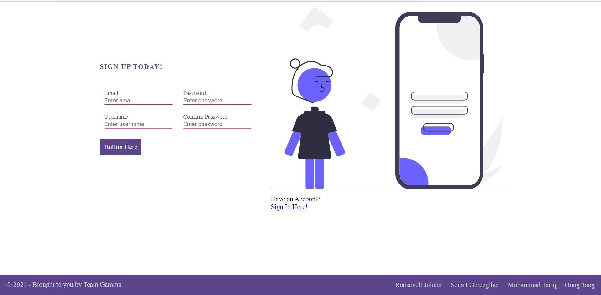

<p align="center"> 
  
</p>

<h1 align="center">Real-Time Chat 👋</h1>

<p align="center">
    
    
    
    
    
    
    
    
    
</p>
  

## Description

🔍Gamma (A MERN stack application) can help drive productivity, Return on Investment (ROI) and efficiency in every industry in this era of digitalization. Creating a chat application is always an interesting thing to do. And it is a good way to learn a lot because you are creating some interactions with your application. In-app chat typically means private, bidirectional chat and direct messaging between or more people within a software application. As you know with the release of a few technologies, we can create such an application without any hassle. It is easier than ever. So, we have created a real-time chat app that is powered by Socket.IO and Mern Stack. This is a web application that allows multiple users to have a private and public chat. This app allows one to one chat online and its fast and easy to use, because it's very user friendly. 


💻 Below is the deployed application:

[Deployed Application](https://gammaucb.herokuapp.com/)
  
💻 Below is a screenshot of the application:

<p align="center">
      
</p>
 
 ## User Story

```
AS a user , I want to chat with my friends in a realtime  
```

## Acceptance Criteria

```
Use React for the front end.
Use GraphQL with a Node.js and Express.js server.
Use MongoDB and the Mongoose ODM for the database.
Use queries and mutations for retrieving, adding, updating, and deleting data.
Be deployed using Heroku (with data).
Is installable
Have a polished UI.
Be responsive.
Be interactive (i.e., accept and respond to user input).
Include authentication (JWT).
Protect sensitive API key information on the server.
Have a clean repository that meets quality coding standards (file structure, naming conventions, best practices for class and id naming conventions, indentation, quality comments, etc.).
Have a high-quality README (with unique name, description, technologies used, screenshot, and link to deployed application).
```
## Table of Contents
- [Description](#Description)
- [User Story](#User-story)
- [Acceptance Criteria](#Acceptance-criteria)
- [Table of Contents](#Table-of-contents)
- [Technologies-Used](#Technologies-Used)
- [LICENSE](#License)
- [Available Scripts](#Available-scripts)
  - [`npm start`](#npm-start)
  - [`npm test`](#npm-test)
  - [`npm run build`](#npm-run-build)
  - [`npm run eject`](#npm-run-eject)
- [Testing](#Testing)
- [Contributing](#Contributing)
- [Questions](#Questions)
- [Learn More](#Learn-more)
  - [Code Splitting](#code-splitting)
  - [Analyzing the Bundle Size](#analyzing-the-bundle-size)
  - [Making a Progressive Web App](#making-a-progressive-web-app)
  - [Advanced Configuration](#advanced-configuration)
  - [Deployment](#Deployment)
  - [`npm run build` fails to minify](#npm-run-build-fails-to-minify)


  ## Technologies-Used

* MongoDB and mongoose
* Express
* React 
* Node
* socket.io
* apollo server
* Apollo Boost
* apollo-express-server
* graphQl
* JWT (JSON Web Token)
* bcrypt
* JSX
* JavaScript
* CSS
* REACT bootsrap
* react-redux
* HTML
* dotenv
* Heroku

## License
 Our app is under MIT license

       < MIT License

        Copyright (c) 2021 Roosevelt ,Senait, Hung ,Muhammed

        Permission is hereby granted, free of charge, to any person obtaining a copy
        of this software and associated documentation files (the "Software"), to deal
        in the Software without restriction, including without limitation the rights
        to use, copy, modify, merge, publish, distribute, sublicense, and/or sell
        copies of the Software, and to permit persons to whom the Software is
        furnished to do so, subject to the following conditions:

        The above copyright notice and this permission notice shall be included in all
        copies or substantial portions of the Software.

        THE SOFTWARE IS PROVIDED "AS IS", WITHOUT WARRANTY OF ANY KIND, EXPRESS OR
        IMPLIED, INCLUDING BUT NOT LIMITED TO THE WARRANTIES OF MERCHANTABILITY,
        FITNESS FOR A PARTICULAR PURPOSE AND NONINFRINGEMENT. IN NO EVENT SHALL THE
        AUTHORS OR COPYRIGHT HOLDERS BE LIABLE FOR ANY CLAIM, DAMAGES OR OTHER
        LIABILITY, WHETHER IN AN ACTION OF CONTRACT, TORT OR OTHERWISE, ARISING FROM,
        OUT OF OR IN CONNECTION WITH THE SOFTWARE OR THE USE OR OTHER DEALINGS IN THE
        SOFTWARE. >


## Available Scripts

In the project root directory, you can run:

### `npm start`

Runs the app in the development mode.<br />
Both the server and react will start and populate as localhost in browser.

The page will reload if you make edits.<br />
You will also see any lint errors in the console.

### `npm test`

Launches the test runner in the interactive watch mode.<br />
See the section about [running tests](https://facebook.github.io/create-react-app/docs/running-tests) for more information.

### `npm run build`

Builds the app for production to the `build` folder.<br />
It correctly bundles React in production mode and optimizes the build for the best performance.

The build is minified and the filenames include the hashes.<br />
Your app is ready to be deployed!

See the section about [deployment](https://facebook.github.io/create-react-app/docs/deployment) for more information.

### `npm run eject`

**Note: this is a one-way operation. Once you `eject`, you can’t go back!**

If you aren’t satisfied with the build tool and configuration choices, you can `eject` at any time. This command will remove the single build dependency from your project.

Instead, it will copy all the configuration files and the transitive dependencies (webpack, Babel, ESLint, etc) right into your project so you have full control over them. All of the commands except `eject` will still work, but they will point to the copied scripts so you can tweak them. At this point you’re on your own.

You don’t have to ever use `eject`. The curated feature set is suitable for small and middle deployments, and you shouldn’t feel obligated to use this feature. However we understand that this tool wouldn’t be useful if you couldn’t customize it when you are ready for it.

## Testing
✏️

No current testing

## Contributing
:octocat: [Rossevelt Jointer](https://github.com/rjointer2)
:octocat: [Muhammad Tariq](https://github.com/mmtariqk)
:octocat: [Hung Tang](https://github.com/htang2021)
:octocat: [Senait Gerezgiher](https://github.com/senait77)

## Questions
✉️ Contact us with any questions:[GitHub](https://github.com/rjointer2/Gamma)<br />

[](https://github.com/rjointer2/Gamma)

This project was bootstrapped with [Create React App](https://github.com/facebook/create-react-app).

## Learn More

You can learn more in the [Create React App documentation](https://facebook.github.io/create-react-app/docs/getting-started).

To learn React, check out the [React documentation](https://reactjs.org/).

### Code Splitting

This section has moved here: https://facebook.github.io/create-react-app/docs/code-splitting

### Analyzing the Bundle Size

This section has moved here: https://facebook.github.io/create-react-app/docs/analyzing-the-bundle-size

### Making a Progressive Web App

This section has moved here: https://facebook.github.io/create-react-app/docs/making-a-progressive-web-app

### Advanced Configuration

This section has moved here: https://facebook.github.io/create-react-app/docs/advanced-configuration

### Deployment

This section has moved here: https://facebook.github.io/create-react-app/docs/deployment

### `npm run build` fails to minify

This section has moved here: https://facebook.github.io/create-react-app/docs/troubleshooting#npm-run-build-fails-to-minify


